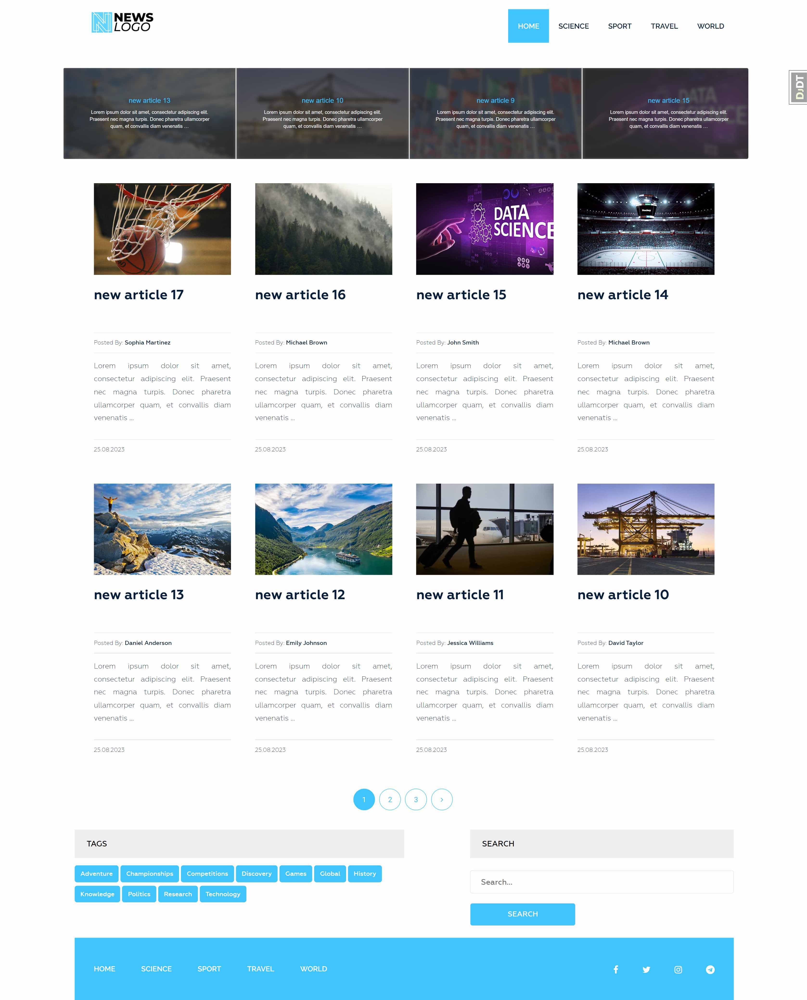
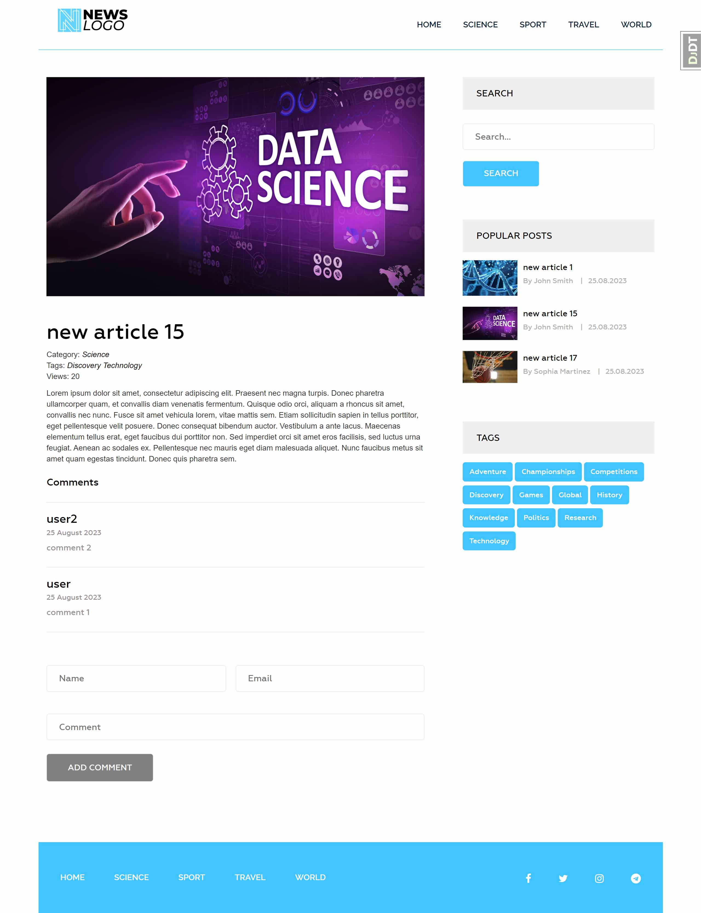
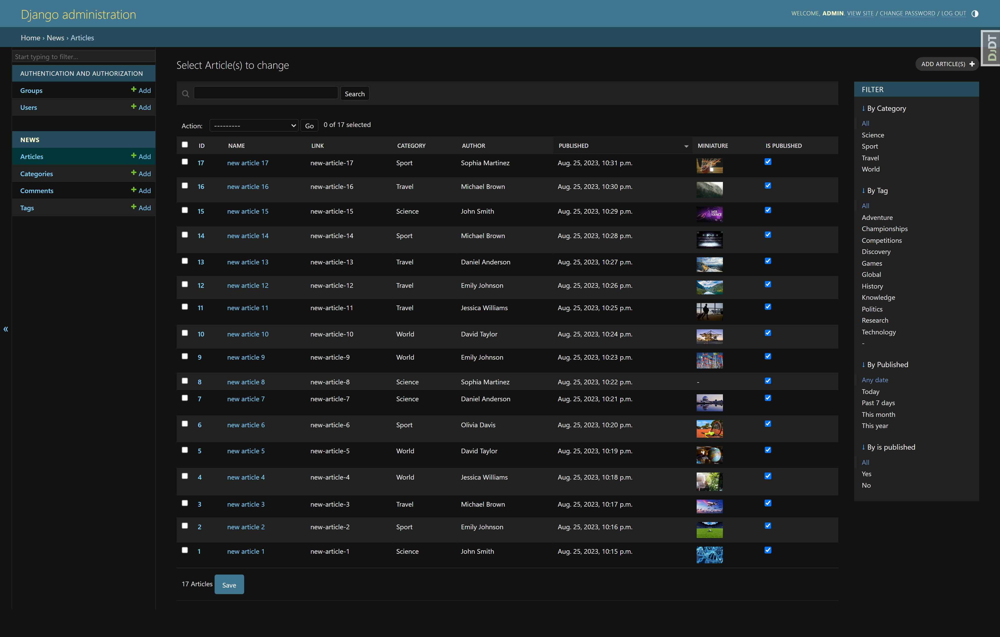

<div align="center">
  <h1>Django News App</h1>
</div>

<div align="justify">

   This project is a News website developed using **Django** that allows users to view and read news in different categories. The site supports news categories, tags, search, number of views, comments and authors.
   
   This project effectively showcases typical features and structures involved in creating similar services.
   
   Key Features:
   
   - View list of news articles with pagination
   - Filtering news by categories and tags
   - Detailed reading of the news on a separate page
   - Commenting on news with the possibility of moderation
   - Search articles by keywords
   - Display of popular news
   - Ability to view articles separately by category
   - Show latest articles in slider

</div>

<br>

<p align="center">
  
  <br>
</p>

<p align="center">
  
  <br>
</p>

<p align="center">
  
  <br>
</p>

<br>

<div align="center">

# Settings
✨ To use it, you need to complete the following steps:

<br>


<div align="left">

1. Clone this repository

   ```
      git clone https://github.com/lazycatcoder/django-news-app.git
   ```

2. Open a terminal and navigate to the project **'django-news-app'** folder

   ```
      cd path/.../django-news-app
   ```

3. Create a virtual environment in the **'django-news-app'** folder
   
   ```
      python -m venv venv
   ```

4. Activate the virtual environment

   ```
      source venv/bin/activate   # MacOS/Linux 

      venv\Scripts\activate      # Windows
   ```

5. Install the following dependencies

   ```
      pip install -r requirements.txt 
   ```

6. Use the console to navigate to the **'django-news-app\news_app'** folder

   ```
      cd news_app
   ```

7. Make migration

   ```
      python manage.py makemigrations
      python manage.py migrate
   ```

8. Сollect static files
   
   ```
      python manage.py collectstatic
   ```

9. Navigate to folder **'django-news-app\news_app\news_app'**
and open the **settings.py** file.

   The next step is to fill in some data in **settings.py**:
   
* Generating a new *SECRET_KEY* in **Django**

   ```
      python -c 'from django.core.management.utils import get_random_secret_key; print(get_random_secret_key())'
   ```

   This command will execute a Python script that imports the *get_random_secret_key()* function and calls it to generate a new key. The result will be printed in the terminal.

   When you get the new key, copy it and paste it into **settings.py** instead of *SECRET_KEY = ' '*'

10. Use the console to navigate to the **'django-news-app\news_app'** folder and run the server 

   ```
      python manage.py runserver
   ```

11. Open a browser and enter the following address to launch the project http://127.0.0.1:8000/ 🚀 

</div>

<br><br>

<div align="justify">

   🔴 to add, delete or edit: news, tags, categories, comments, you can use the **Django** admin panel *(login: admin, password: admin)* http://127.0.0.1:8000/admin/ or you can create a new superuser for this use the console to navigate to the **'django-news-app\news_app'**
      
   ```
      python manage.py createsuperuser
   ```

</div>